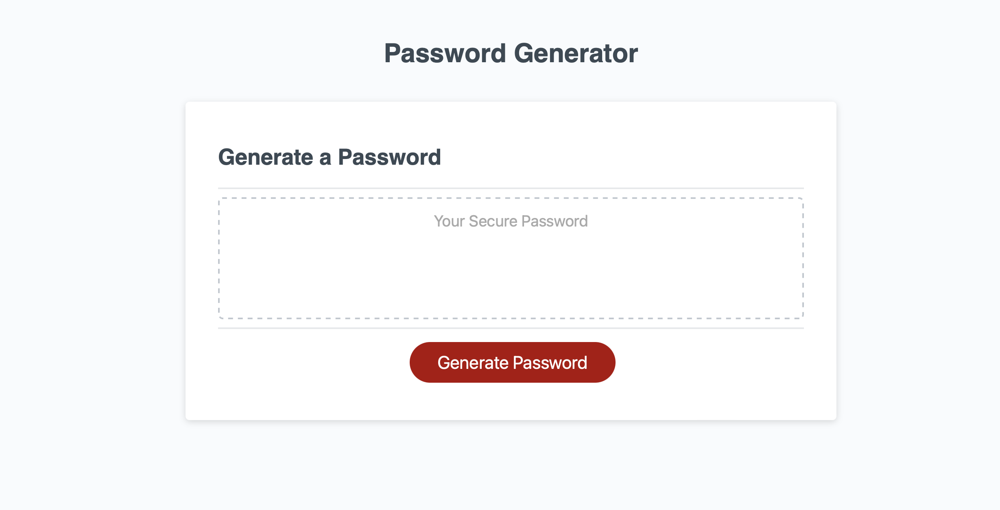
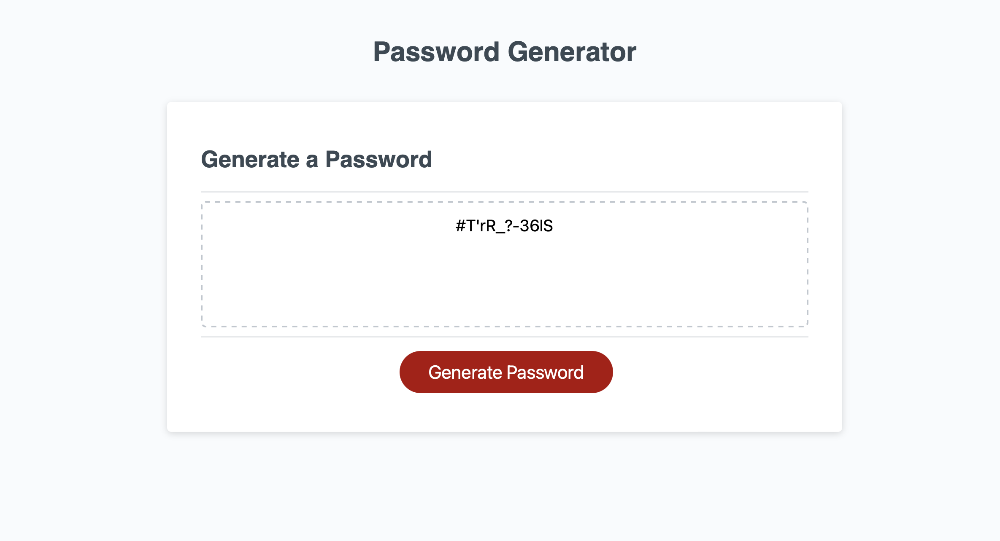

# Password Generator

Refactoring Password Generator Code 

## Description

A random password generator allows the user to make a password with special characters, numbers, lowercase characters, and upper case characters. 

## Deployment 

URL of Deployment: 

https://jagpreetrandio.github.io/Functional-berries/

## Usage

 
 

## Credits

N/A

## License

N/A
